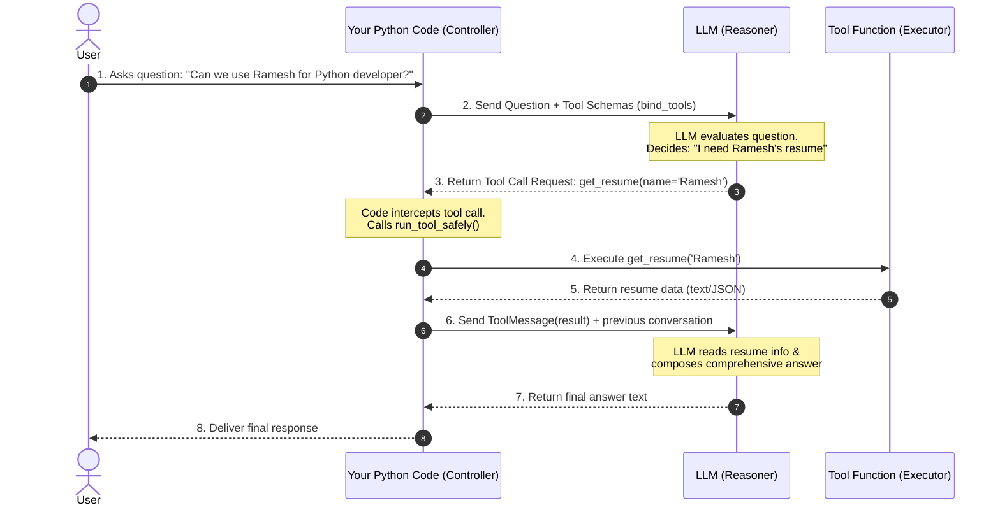
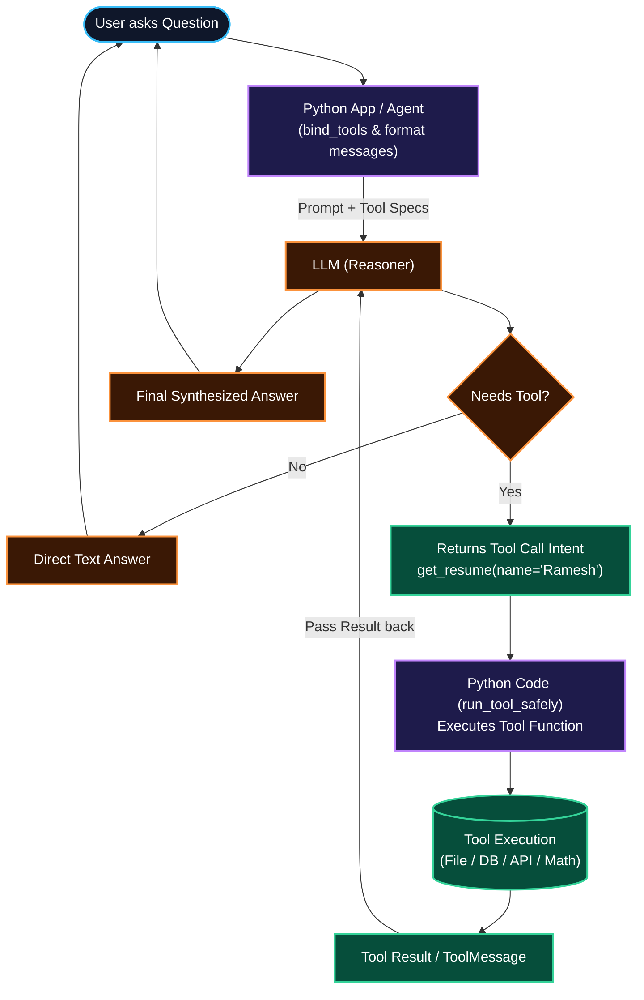

# Ep 04 — Tool Calling (Student Notes)

**Level:** Beginner → applied · **Study time:** 60–75 min
**Goal:** Give the LLM **hands** — let it call your Python functions safely, with schemas, validation, and error handling.

---

## 1. The idea
An LLM alone can only produce text. **Tools** let it *do* things: calculate, search, query a DB, call an API.

**How it works (the flow):**
1. You describe tools to the model (name + description + argument schema).
2. The model, when needed, replies "call `tool_x` with these args" (it does **not** run anything itself).
3. **Your code runs the tool** and sends the result back.
4. The model uses the result to answer or call another tool.





> The model **decides**; **your code executes**. This separation is also a security boundary (Ep 36) — the model never directly touches your system.

---

## 2. Core concepts

### 2.1 Defining a tool
```python
from langchain_core.tools import tool

@tool
def get_weather(city: str) -> str:
    """Get current weather for a city."""   # <- description matters a lot
    ...
```
The **docstring + type hints become the schema** the model sees. Write clear descriptions — the model picks tools based on them.

> **Three quick Python terms used above:**
> - **`@tool` (a decorator):** the `@something` line just above a function *wraps* it to add behavior. Here `@tool` turns a normal Python function into a tool the LLM can call — you don't write that plumbing yourself.
> - **Type hints (`city: str` → `str`):** they say "this argument is text, and the function returns text." The LLM uses them to send the right kind of value.
> - **Docstring (the `""" ... """` line):** the description right under `def`. The model reads it to decide *when* to use the tool — so write it clearly.
> - **Schema:** the auto-generated "spec sheet" (tool name + arguments + types + description) that the model receives. You get it for free from the hints + docstring.

### 2.2 Schemas come from Pydantic/type hints (Ep 03 through-line!)
Argument types are validated. For complex args, use a Pydantic model — exactly what you learned last episode.

### 2.3 Binding tools
```python
llm_with_tools = llm.bind_tools([get_weather, add])
response = llm_with_tools.invoke("weather in Mumbai?")
response.tool_calls   # -> [{'name': 'get_weather', 'args': {'city': 'Mumbai'}, 'id': ...}]
```

### 2.4 Multiple tools
Bind many; the model chooses the right one(s) per request. Good descriptions prevent wrong picks.

### 2.5 Error handling & retries (production reality)
Tools fail: bad args, network errors, timeouts. You must:
- **validate args** before running,
- **catch exceptions** and return a useful error message (not a crash),
- optionally **retry** transient failures.
A tool that crashes the whole agent is a junior mistake. (Scaled up in Ep 11 with `ToolNode`.)

---

## 3. Build: an LLM that calls custom tools safely
`code/final/tool_calling.py`:
- 4 simple tools: `add` (math), `get_weather` (mocked API), `lookup_user` (mock DB), and `get_resume` (reads candidate resumes from `resumes/`).
- Each tool does **one** simple job with clear inputs and output.
- Catches errors so a broken tool never crashes the agent.
- Shows the full manual loop: model → tool call → run → feed result → final answer.

Run:
```bash
cd code/final
python tool_calling.py
```

**Expected output** (verified with `DEMO_MODEL` — wording varies):
```text
USER: Can we use Ramesh for Python developer? Should we select him for interview?

Tool call: get_resume({'name': 'Ramesh'})
Result: Name: Ramesh Kumar
Role: Python Developer
Experience: 4 years
Skills: Python, FastAPI, Django, PostgreSQL, Docker, Git, REST APIs
...

AI: Yes, Ramesh should be selected for the Python developer interview. He has 4 years of experience working with Python, FastAPI, Django, PostgreSQL, and Docker, which directly matches the role requirements.
```

### Code walkthrough (step by step)
| Step | What it does | Why it matters |
|---|---|---|
| **STEP 1** | Define tools with `@tool` (`add`, `get_weather`, `lookup_user`, `get_resume`) | Docstring + types become the schema the model reads |
| **STEP 2** | Put tools in a name→tool dict | So we can run a tool by the name the model returns |
| **STEP 3** | `run_tool_safely()` | A failing tool returns an error, never crashes |
| **STEP 4** | `bind_tools()` | Tells the model which tools exist |
| **STEP 5** | first `invoke` | Model *requests* tool calls (doesn't run them) |
| **STEP 6** | run tools, append `ToolMessage` | Your code executes; results go back to the model |
| **STEP 7** | final `invoke` | Model uses results to write the answer |

> **Security note:** these tools are deliberately tiny and safe — `add` just returns `a + b` (no `eval`, no surprises), `get_weather`/`lookup_user` read from small built-in dictionaries, and `get_resume` safely reads known files inside `resumes/`. When a tool makes real web requests (Ep 08) we add SSRF protection (validate/allow-list URLs).

---

## 4. What you learned
- Tools = the LLM's hands; model decides, your code executes.
- Schemas from docstrings + type hints (+ Pydantic).
- `bind_tools`, reading `tool_calls`, the manual tool loop.
- Robust validation + error handling (the job-grade part).

## 5. Self-check
1. Who actually *runs* a tool — the model or your code?
2. Why does a tool's docstring matter?
3. Name two things you must do so a failing tool doesn't crash the agent.

## 6. Homework
`exercises.md` — add a tool, feed bad arguments, and make sure it fails gracefully.

---

**Next (Ep 05):** Now we connect reasoning + tools in a **loop** — your first real agent, **in raw Python, no framework**, so you truly understand the magic.

---

## References & Verify (official docs · verified June 2026)
Master list: [`../../REFERENCES.md`](../../REFERENCES.md). Open them and verify it yourself.
- **Tools / `@tool` + tool calling:** https://docs.langchain.com/oss/python/langchain/tools
- **Models (`bind_tools`):** https://docs.langchain.com/oss/python/langchain/models

> Tested with: Python 3.13, `langchain` 1.3.18 (run end-to-end 30 Aug 2026 on `gpt-5.6-luna`).
