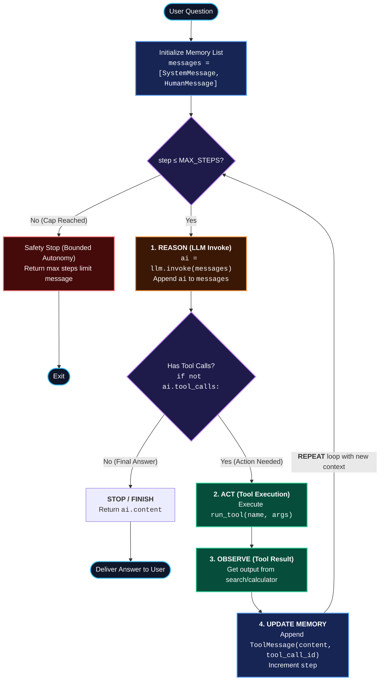

# Ep 05 — Build an AI Agent in Raw Python (Student Notes)

**Level:** Beginner → core understanding · **Study time:** 75–90 min
**Goal:** Build a real agent **by hand, no framework**, so the agent loop never feels like magic. After this, LangGraph will make total sense.

---

## 1. The ReAct loop (the heart of every agent)
**ReAct = Reason + Act.** The agent repeats:

```
1. REASON   — model thinks: what should I do next?
2. ACT      — it calls a tool (or decides it's done)
3. OBSERVE  — read the tool result
4. REPEAT   — loop back with the new info, until the goal is met
```

### Agent Loop Flowchart
The control flow showing how the `for` loop, state list (`messages`), tool execution, and the safety cap work together:



### Multi-Step Execution Trace (Sequence Diagram)
How the agent solves *"What is the population of Japan divided by 2?"* across iterations:

```mermaid
sequenceDiagram
    autonumber
    actor User
    participant Loop as Python Agent Loop (Controller)
    participant Memory as Message State (List)
    participant LLM as LLM Reasoner (Groq/OpenAI)
    participant Tools as Tool Handlers (search / calc)

    User->>Loop: "What is the population of Japan divided by 2?"
    Loop->>Memory: Append SystemMessage + HumanMessage
    
    rect rgb(25, 30, 45)
        note over Loop,Tools: Step 1: Search population (Reason -> Act -> Observe)
        Loop->>Memory: Read conversation history
        Loop->>LLM: invoke(messages + tool_definitions)
        LLM-->>Loop: ai (tool_calls: search("Population of Japan 2024"))
        Loop->>Memory: Append AIMessage(tool_calls)
        Loop->>Tools: run_tool("search", {"query": "Population of Japan 2024"})
        Tools-->>Loop: "Japan's population is about 124 million."
        Loop->>Memory: Append ToolMessage("Japan's population is about 124 million.")
    end

    rect rgb(25, 30, 45)
        note over Loop,Tools: Step 2: Calculate half (Reason -> Act -> Observe)
        Loop->>Memory: Read updated history (includes search result)
        Loop->>LLM: invoke(messages)
        LLM-->>Loop: ai (tool_calls: calculator("124000000/2"))
        Loop->>Memory: Append AIMessage(tool_calls)
        Loop->>Tools: run_tool("calculator", {"expression": "124000000/2"})
        Tools-->>Loop: "62000000.0"
        Loop->>Memory: Append ToolMessage("62000000.0")
    end

    rect rgb(25, 30, 45)
        note over Loop,Tools: Step 3: Synthesize final answer (No tool calls -> Return)
        Loop->>Memory: Read updated history (search + calc results)
        Loop->>LLM: invoke(messages)
        LLM-->>Loop: ai (content: "The population of Japan divided by 2 is 62,000,000.", tool_calls: [])
        Loop->>Memory: Append AIMessage(final_answer)
    end

    Loop-->>User: Deliver Final Answer (Finished in 3 steps)
```

This is *the* pattern. Frameworks (LangGraph) just make this loop robust, persistent, and scalable. Today we write it ourselves.

> **Fun fact:** the AI coding assistants you code *with* (Claude Code, Cursor) are themselves exactly this ReAct loop — reason → act (edit/run a file) → observe the output → repeat. Aaj tum wahi loop khud banaoge.

---

## 2. The pieces we need
1. **Tools** (from Ep 04) — the agent's hands.
2. **A loop** that keeps calling the model until it produces a final answer.
3. **A stopping condition** — so it can't loop forever (max iterations). *This is bounded autonomy — a real safety concept we expand in Ep 36.*
4. **Simple memory** — a growing list of messages so the model remembers what it already did.

---

## 3. Why we do this manually first
You'll *feel* the problems frameworks solve:
- "What if it loops forever?" → need max steps.
- "What if a tool fails?" → need error handling.
- "How does it remember?" → you manage the message list by hand.
- "What if it crashes midway?" → you'd lose everything (no persistence).

These pains are exactly **why LangGraph exists** (Ep 06).

---

## 4. Build: a from-scratch ReAct agent
`code/final/raw_agent.py`:
- Binds tools, runs a manual loop.
- Stops at a final answer **or** a max-iteration cap (safety).
- Keeps a message list as memory.
- Prints each reason/act/observe step so you see the loop.

Run:
```bash
cd code/final
python raw_agent.py
```

**Expected output** (verified 30 Aug 2026 · `gpt-5.6-luna` — wording/steps vary):
```text
USER: What is the population of Japan divided by 2?

Step 1 — REASON+ACT: search({'query': 'Population of Japan 2024'})
          OBSERVE: Japan's population is about 124 million.
Step 2 — REASON+ACT: calculator({'expression': '124000000/2'})
          OBSERVE: 62000000.0
(finished in 3 step(s))

FINAL ANSWER: The population of Japan divided by 2 is 62,000,000. ...
```
Watch the multi-step loop: it **searches** first, then **calculates** with the observed number, then answers — that's reason → act → observe → repeat.

### Code walkthrough (step by step)
| Step | What it does | Why it matters |
|---|---|---|
| **STEP 1** | `MAX_STEPS` cap | Bounded autonomy — no infinite loop |
| **STEP 2** | define `search` + `calculator` tools | The agent's hands |
| **STEP 3** | `messages` list | Memory we manage by hand |
| **STEP 4** | the `for` loop | The ReAct loop itself |
| **STEP 4a** | `llm.invoke(messages)` | REASON: model decides next move |
| **STEP 4b** | `if not ai.tool_calls: return` | STOP: final answer reached |
| **STEP 4c** | run tool + append `ToolMessage` | ACT + OBSERVE, then repeat |
| **STEP 5** | hit the cap | Fail safely instead of looping forever |

---

## 5. Where raw code breaks (feel the pain)
- No persistence (crash = start over).
- Manual, fragile state management.
- No built-in retries/timeouts/streaming.
- Hard to add branching, parallelism, human approval.
- Gets messy fast with many tools/agents.

> Keep this file — in Ep 07 you'll rebuild the *same* agent in LangGraph and see how much cleaner and stronger it becomes.

---

## 6. What you learned
- The **ReAct loop**: reason → act → observe → repeat.
- Stopping conditions = **bounded autonomy** (no infinite loops).
- Manual memory via a message list.
- Concrete reasons frameworks exist.

## 7. Self-check
1. What are the 4 steps of the ReAct loop?
2. Why do we cap iterations?
3. Name two problems with hand-rolled agents that a framework fixes.

## 8. Homework
`exercises.md` — add a tool, add a max-step guard, and trigger the loop limit on purpose.

---

**Next (Ep 06):** This works… but it's fragile. Next we see **exactly why frameworks exist**, and decode **LangChain vs LangGraph vs deepagents** — when to use which.

---

## References & Verify (official docs · verified June 2026)
Master list: [`../../REFERENCES.md`](../../REFERENCES.md). Open them and verify it yourself.
- **ReAct paper (reason + act loop):** https://arxiv.org/abs/2210.03629
- **Tools / `@tool`:** https://docs.langchain.com/oss/python/langchain/tools
- **(What `create_agent` does for you internally):** https://docs.langchain.com/oss/python/langchain/agents

> Tested with: Python 3.13, `langchain` 1.3.18 (run end-to-end 30 Aug 2026 on `gpt-5.6-luna`).
