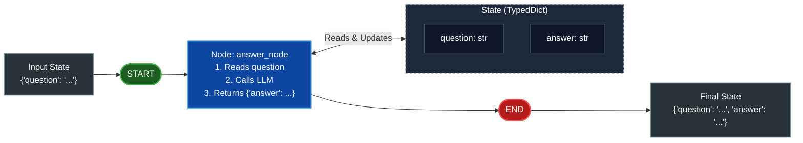

# Ep 06 — LangChain vs LangGraph vs deepagents (Student Notes)

**Level:** Beginner → architectural judgment · **Study time:** 60 min
**Goal:** Understand *why* frameworks exist, map the 4 agentic framework paradigms, decode the LangChain ecosystem's 3 layers, and build your first `StateGraph` ("hello graph").

---

## 1. Why frameworks (recall Ep 05's pain)
Your raw agent worked but was fragile: no persistence, manual state, no retries/timeouts, hard to branch. **Frameworks give you these for free** so you build features, not plumbing.

---

## 2. The Agentic AI framework landscape (the 4 paradigms)
When choosing a framework, the industry has shifted away from prompt-based "role-play" demos toward **resilient, stateful orchestration**. Today's frameworks fall into 4 main paradigms:

| Paradigm | Leading Frameworks | Mental Model | Best For | Enterprise Tradeoff |
|---|---|---|---|---|
| **1. Graph & State Machines** *(Our Spine)* | **`langgraph`**, LlamaIndex Workflows | **Nodes + Edges + State** (Cyclic state machine) | Mission-critical workflows, persistence, Human-in-the-Loop (HITL) | Steeper learning curve; requires strict schema design |
| **2. Role-Playing Multi-Agent** | CrewAI, AutoGen (v0.4+), OpenAI Agents SDK | **Personas + Tasks + Handoffs** (Agent-to-agent chat) | Rapid prototyping, brainstorming simulations, marketing crews | Hard to control deterministically; high token spend, fragile loops |
| **3. Type-Safe / Minimalist** | PydanticAI, smolagents (Hugging Face), Agno | **Typed validation & Python-native logic** | Developers wanting clean code without heavy framework magic | Fewer enterprise-grade multi-agent orchestration primitives |
| **4. Autonomous Coding / Task Agents** | OpenHands, MetaGPT, `deepagents` | **Goal-seeking loop + Filesystem sandbox** | Long-running software development & open-ended tasks | High execution risk; requires sandboxing and strict cost bounds |

---

## 3. Why we are learning LangChain & LangGraph (Our Course Spine)
Why not start with CrewAI or simple prompt chains? Because **enterprises hire for production reliability, not prototype demos**:

1. **Deterministic Control over "Chatter":** In frameworks like CrewAI or classic AutoGen, agents talk to each other in natural language. In production, chat loops easily derail or burn thousands of dollars in tokens. LangGraph models agents as **state machines** with exact conditional edges—you control precisely what runs when.
2. **Durable Persistence & Time-Travel:** LangGraph automatically checkpoints state at every node. If a database or API fails mid-task, the agent resumes from the exact failure point without restarting. You can even roll back to a previous state ("time-travel debugging").
3. **Native Human-in-the-Loop (HITL):** Enterprise agents cannot execute sensitive actions (e.g., refunding money, dropping tables, sending emails) without human review. LangGraph allows pausing execution before a node, awaiting user confirmation, and resuming seamlessly.
4. **Decoupled Architecture:** `langchain` provides battle-tested connectors (models, retrievers, tools); `langgraph` provides the execution engine; `LangSmith` provides end-to-end tracing and evaluation.
5. **Highest Job Demand:** Job listings for Agentic AI Engineers heavily specify **LangGraph** because it is the standard for mission-critical, auditable deployments.

---

## 4. The LangChain ecosystem — 3 layers (know when to use which)
| Layer (version we use) | What it is | Use when | This course |
|---|---|---|---|
| **`langchain`** (1.3.x) | High-level, fast; 600+ integrations, prebuilt agents | You want speed / standard patterns | Building blocks (loaders, retrievers, models) |
| **`langgraph`** (1.2.x) | Low-level **control** — graphs, state, branching, persistence | You need production control & custom flows | **Our spine — most of the course** |
| **`deepagents`** (0.7.x — pre-1.0, pin carefully) | Long-running, highly autonomous agents | Open-ended, long tasks | Bonus B1 |

**Plus LangSmith** (not a framework — a platform): observe, evaluate, deploy, monitor (Season 5).

> **Interview line:** "I reach for `langchain` for speed, `langgraph` when I need control and production reliability, and `deepagents` for long-running autonomy. LangSmith covers observability and eval across all of them."

### Why LangGraph for jobs
- It's the **enterprise standard** and the **highest-paying framework-specific skill** in agentic listings.
- It models an agent as a **graph**: nodes (steps) + edges (flow) + shared **state**. That graph = the agent's brain, and it's inspectable, persistent, and controllable.

---

## 5. Mental model: "graph = brain"
- **State** = what the agent knows right now (here: `question` and `answer`).
- **Node** = a Python function that reads state and returns an update (`answer_node`).
- **Edge** = wires nodes together (`START -> answer -> END`).
- **`START` / `END`** = entry point and exit point of the graph.

### Ep 06 Graph Architecture ("hello graph")



You define the State, register Nodes and Edges, compile the graph, and then `.invoke()` or `.stream()` it.

> **New word — `TypedDict`:** in the code you'll write `class State(TypedDict): ...`. A `TypedDict` is just a normal Python dictionary where you declare the keys and their types up front. It's how we describe the "shape" of the state. (We go deep on state in Ep 09 — here just know it's a typed dictionary.)

---

## 6. Build: "hello graph"

**Install LangGraph first** (in your project from Ep 02 — note the pin):
```bash
uv add "langgraph~=1.2.11"
```
`~=1.2.11` = "1.2.11 or a newer 1.2.x patch" — the version this course is tested on.

`code/final/hello_graph.py` — a minimal `StateGraph` with one node that calls an LLM. Tiny on purpose: you learn the *shape* (State → node → edges → compile → invoke) before adding complexity in Ep 07.

Run:
```bash
cd code/final
python hello_graph.py
```

**Expected output** (verified 30 Aug 2026 · `gpt-5.6-luna` — wording will vary):
```text
Q: What is an AI agent, in one line?
A: An AI agent is an autonomous system that perceives its environment, reasons about actions, and executes those actions to achieve its goals.
```

### Code walkthrough (step by step)
| Step | What it does | Why it matters |
|---|---|---|
| **STEP 1** | define `State` (TypedDict) | What the graph carries |
| **STEP 2** | `answer_node(state)` | A node reads state, returns an update |
| **STEP 3** | `StateGraph(State)` | Create the graph |
| **STEP 4** | `add_node` | Add a step |
| **STEP 5** | `add_edge(START, ...)`, `... END` | Wire the flow |
| **STEP 6** | `.compile()` | Turn it into a runnable |
| **STEP 7** | `.invoke({...})` | Run with initial state |

---

## 7. What you learned
- Frameworks remove plumbing pain (state, retries, branching).
- The 4 framework paradigms (Graph vs Role-play vs Minimalist vs Autonomous).
- Why enterprise hires for LangGraph (deterministic control, state persistence, HITL).
- The 3 layers of the LangChain ecosystem (`langchain` / `langgraph` / `deepagents`) + LangSmith.
- "Graph = brain": State, nodes, edges, START/END.
- Built your first `StateGraph`.

## 8. Self-check
1. What are the 4 main paradigms of agentic AI frameworks, and why do enterprises prefer graph-based state machines over role-play chat?
2. When would you pick `langchain` vs `langgraph` vs `deepagents`?
3. What are nodes, edges, and state in LangGraph?
4. Why is LangGraph valuable on a resume?

## 9. Homework
`exercises.md` — add a second node and an edge between them.

---

**Next (Ep 07):** We rebuild Ep 05's agent **the professional way** in LangGraph — same agent, half the pain, ten times more powerful.

---

## References & Verify (official docs · verified June 2026)
Master list: [`../../REFERENCES.md`](../../REFERENCES.md). Open them and verify it yourself.
- **What's new in LangChain v1 (the 3 layers + `create_agent`):** https://docs.langchain.com/oss/python/releases/langchain-v1
- **Agents (`create_agent`):** https://docs.langchain.com/oss/python/langchain/agents
- **Workflows & agents (low-level graphs):** https://docs.langchain.com/oss/python/langgraph/workflows-agents
- **deepagents:** https://github.com/langchain-ai/deepagents

> Tested with: `langgraph` 1.2.11, `langchain` 1.3.18 (run end-to-end 30 Aug 2026 on `gpt-5.6-luna`).
